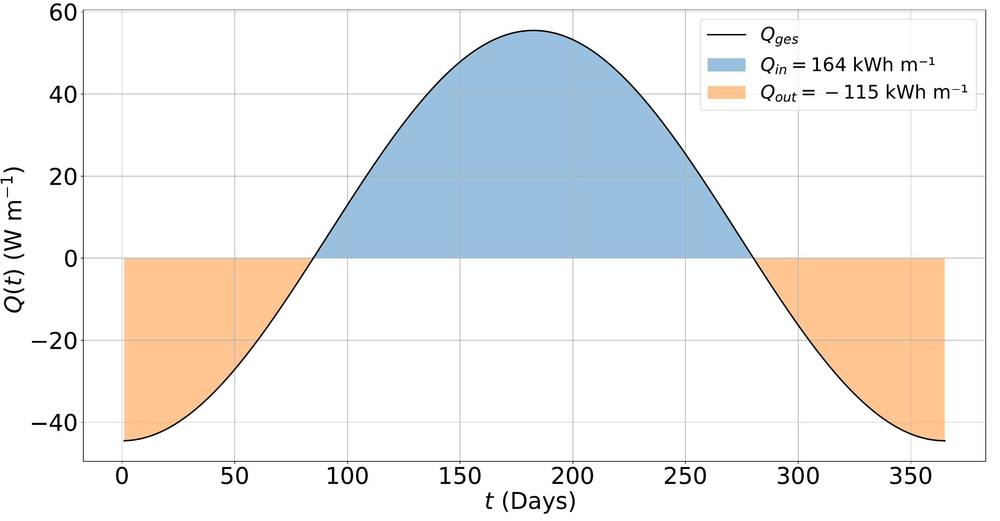

# SubTerra

This project requires FEniCS, gmsh and more. 
**Using the provided Docker container is strongly recommended.**

## Setup with Docker Container

### Build Docker Image

1. **Clone the repository:**
   ```bash
   git clone https://github.com/USERNAME/subterra.git
   cd subterra
   ```
   
2. **Build the image:**
   ```bash
   docker build -t subterra:local -f .devcontainer/Dockerfile .
   ```

3. **Run the container:**
   ```bash
   docker run -it -v $(pwd):/home/SubTerra subterra:local /bin/bash
   ```

3. **Inside the container, run and modify your simulations**

## Functionality

A Python-based toolkit for two dimensional simulations of borehole thermal energy storage (BTES) with finite elments using FEniCS [^1]. For the calculation the heat transport equation is be solved:

$$
\frac{\partial T}{\partial t}- a_{\mathrm{eff}}  \Delta T+ b  (\mathbf{v}\cdot \nabla T)= \frac{f}{(\rho c)_{\mathrm{g}}},
$$

$$
a_{\mathrm{eff}} = \left( \frac{\kappa}{\rho c} \right)_{\mathrm{eff}}, \ \ \ \ \ \ \ \ \ b = n_{\mathrm{p}} \frac{(\rho c)_{\mathrm{w}}}{(\rho c)_{\mathrm{g}}}.
$$

**Key assumtions:**

- Both media (water, ground) are assumed to have *similar temperatures*:   $T_\mathrm{w} = T_\mathrm{g}$ [^2].
- Vertical groundwater flow and pressure effects are neglected; water density $\rho_w$ is *temperature-independent* [^2] 
- The soil is *homogeneous* and *isotropic* with respect to $\kappa_g$ and $(\rho c)_g$.
- The terrestrial heat flux ($\approx 65 \text{mWm}^{-2}$) is negligible relative to the BHE heat rate.
- Assuming vertical symmetry, the numerical analysis can be reduced to *two dimensions*.
- *Dirichlet boundary conditions*, where at great distance the ground temperature $T_0$ is kept constant.
- The individual BHEs are modeled using the FEniCS `PointSource()` function with time-dependent heat flux: $f(t, \mathbf{r}) = q(t)\sum_j \delta(\mathbf{r}-\mathbf{r}_j)$.
- The *heat utilization rate* $\eta$ is the ratio of extracted heat over stored heat determined by:

  $q(t)  = A - B \cos \left( \frac{2 \pi}  {t_\mathrm{year}} \cdot t \right) \Rightarrow \eta = \frac{Q_\mathrm{out}}{Q_\mathrm{in}}$

<p align="center">
  
</p>

**Numerical checks:**

The conservation of energy is numerically checked for each time step: 

$$
\begin{aligned}
\int_{t_i}^{t_i + \Delta t} \mathrm{d}t \  q(t) + \int_\Omega \mathrm{d}V \  \rho c \big[T(\mathbf{r}, t_i + \Delta t) - T(\mathbf{r}, t_i)\big]  - \int_{\partial \Omega} \mathrm{d}s \ \kappa \big[\mathbf{n} \cdot \nabla T\big]
= 0
\end{aligned}
$$

The Peclet number $Pe$ is checked before every simulation:

$$
Pe = \frac{v_{x} \cdot \Delta x}{a_\mathrm{eff}} \leq 2.
$$

## Project Structure

```
subterra/
├── Dockerfile              # Docker image definition 
├── main.py                 # Main routine
├── requirements.txt        # Python dependencies
├── params/                 # Parameter files
│   ├── parameter.json      # Input parameters
│   ├── parameter_si.json   # Auto-generated SI units
│   └── temp/               # Temporary mesh files
├── src/                    # Core packages
│   ├── calculation.py      # Main simulation with FEniCS
│   ├── convert_to_si.py    # Parameter unit conversion
│   ├── h5py_writer.py      # HDF5 setup
│   ├── mesh.py             # Mesh handling utilities
│   ├── plot.py             # Visualization functions
│   ├── powerprofile.py     # Power profile calculations
│   ├── paths.py            # Path 
│   └── tools.py            # Helper functions
└── results/                # Output directory
```

## Usage

## Input Parameters

Edit `params/parameter.json` to configure the simulation.

### Mesh configuration (`"meshMode"`)

Defines the BHE layout:

- Single BHE  
  `"meshMode": ["hexa", 0]`

- Square grid with 2 rings  
  `"meshMode": ["square", 2]`

- Hexagonal grid with 3 rings  
  `"meshMode": ["hexa", 3]`

Format:
`["type", rings]`  
`type:` = grid type,  
`rings` = number of surrounding BHE rings

### BHE properties
`"power"` – change BHE properties

### BTES geometry
`"mesh"` – change BTES geometry and mesh resolution

### Subsurface properties
`"ground"` and `"groundwater"` – with `"modelType"` defined after. [^3]


<div align="center">

<em>Table 1: Overview of model parameters</em>

<table>
<tr><th></th><th>Parameters</th></tr>
<tr><td>Ground</td><td>ρ<sub>g</sub>, c<sub>g</sub>, κ<sub>g</sub>, T₀</td></tr>
<tr><td>Water</td><td><b>v</b> = (v<sub>x</sub>, v<sub>y</sub>)<sup>T</sup>, ρ<sub>w</sub>, c<sub>w</sub></td></tr>
<tr><td>Model</td><td>{1,2,3}, n<sub>p</sub></td></tr>
<tr><td>Mesh</td><td>L<sub>x</sub>, L<sub>y</sub>, ms, ms<sub>fine</sub></td></tr>
<tr><td>Time</td><td>Δt, t<sub>end</sub></td></tr>
<tr><td>BHE</td><td>η, γ, T<sub>H</sub>, r<sub>BHE</sub></td></tr>
<tr><td>BTES</td><td>square / hexagonal, N, d</td></tr>
</table>

</div>

> [TODO](#TODO) How to actually run?

### Run Simulations

First set your parameters in `params/parameter.json` and then run the main routine:

```bash
python3 -m src.main run
```


### Output

After running simulations:
- **HDF5 files**: `results/<case_name>/sim_<time>.h5` — Full simulation state with temperature fields
- **COP-values**: based on the tempeature field and the input parameter every single BHE and the overall COP is estimated.
- **Plots**: Temperature field visualizations:

```bash
python3 -m src.main plot <h5_path>
```

<p align="center">
  
</p>

Numerically computed 1D temperature profiles for different time steps 
($20 \mathrm{a}$, $30 \mathrm{a}$, $40 \mathrm{a}$, $50 \mathrm{a}$) 
along the x-axis ($y = 0$) and the 2D contour plot after $t = 30\,\mathrm{a}$ 
for the simulation with 37 BHEs ($d = 3\,\mathrm{m}$), 
thermal conductivity $\kappa = 2.11\,\mathrm{W\,m^{-1}\,K^{-1}}$, 
groundwater velocity $v_x = 2.5\,\mathrm{cm\,day^{-1}}$, 
utilization rate $\eta = 0.7$, 
and porosity $n_\mathrm{p} = 0.2$.

### Viewing Results

You can inspect HDF5 files with VSCode extension [H5Web](https://marketplace.visualstudio.com/items?itemName=h5web.vscode-h5web) or use the built-in plotting utilities in `src/plot.py`:
inspect HDF5 files with Python:
```python
import h5py
with h5py.File('results/your_simulation/sim_20years.h5', 'r') as f:
    print(list(f.keys()))
```

## Nomenclature

<div align="center">

<table>
<tr>
<th>Symbol</th>
<th>Description</th>
<th>Unit</th>
</tr>

<tr><td>$T(t,\mathbf{r})$</td><td>Temperature</td><td>$\mathrm{K}$</td></tr>
<tr><td>$t$</td><td>Time</td><td>$\mathrm{s}$</td></tr>
<tr><td>$\mathbf{v}$</td><td>Velocity vector field</td><td>$\mathrm{m\,s^{-1}}$</td></tr>
<tr><td>$\rho$</td><td>Density</td><td>$\mathrm{kg\,m^{-3}}$</td></tr>
<tr><td>$a_\mathrm{eff}$</td><td>Diffusion constant</td><td>$\mathrm{m^{2}\,s^{-1}}$</td></tr>
<tr><td>$b$</td><td>Convection constant</td><td>—</td></tr>
<tr><td>$f(t,\mathbf{r})$</td><td>Heat source / sink</td><td>$\mathrm{W\,m^{-3}}$</td></tr>
<tr><td>$c$</td><td>Thermal capacity</td><td>$\mathrm{J\,kg^{-1}\,K^{-1}}$</td></tr>
<tr><td>$\kappa$</td><td>Thermal conductivity</td><td>$\mathrm{W\,m^{-1}\,K^{-1}}$</td></tr>
<tr><td>$n_\mathrm{p}$</td><td>Porosity</td><td>—</td></tr>
<tr><td>$Pe$</td><td>Peclet number</td><td>—</td></tr>
<tr><td>$Q$</td><td>Thermal energy</td><td>$\mathrm{kWh\,m^{-1}}$</td></tr>
<tr><td>$q(t)$</td><td>Thermal power profile</td><td>$\mathrm{W\,m^{-1}}$</td></tr>
<tr><td>$\mathbf{r}$</td><td>Position vector</td><td>$\mathrm{m}$</td></tr>
<tr><td>$\Omega$</td><td>Domain</td><td>$\mathrm{m}$</td></tr>
<tr><td>$\mathbf{n}$</td><td>Normal vector</td><td>$\mathrm{m}$</td></tr>
<tr><td>$\Delta x$</td><td>Maximum mesh size</td><td>$\mathrm{m}$</td></tr>
<tr><td>$\mathrm{COP}$</td><td>Coefficient of performance</td><td>—</td></tr>
<tr><td>$\gamma$</td><td>Engineering factor</td><td>—</td></tr>
<tr><td>$ms$</td><td>Mesh size factor</td><td>$\mathrm{m}$</td></tr>
<tr><td>$\eta$</td><td>Heat utilization rate</td><td>—</td></tr>
<tr><td>$W, E$</td><td>Energy</td><td>$\mathrm{kWh\,m^{-1}}$</td></tr>
<tr><td>$r$</td><td>Radius</td><td>$\mathrm{m}$</td></tr>
<tr><td>$d$</td><td>BHE spacing distance</td><td>$\mathrm{m}$</td></tr>
<tr><td>$L$</td><td>Size of calculation area</td><td>$\mathrm{m}$</td></tr>

</table>

</div>

---

[^1]: Alnaes, M. S., et al. (2015). The FEniCS Project Version 1.5. *Archive of Numerical Software, 3*.

[^2]: Kobus, H. (1992). Schadstoffe im Grundwasser. Wärme- und Schadstofftransport im Grundwasser. In H. Kobus (Hrsg.), *Wärme- und Schadstofftransport im Grundwasser*. Weinheim: VCH.
   
[^3]: Arbeitskreis Geothermie, et al. (2015). *Empfehlungen Oberflächennahe Geothermie – Planung, Bau, Betrieb und Überwachung (EA Geothermie)*. Berlin: Ernst und Sohn.

## License

**SubTerra: Copyright, license, and disclaimer of warranty**

See COPYING for copyright and a list of contributors.

SubTerra is free software: you can redistribute it and/or modify it under the terms of the GNU General Public License as published by the Free Software Foundation, either version 3 of the License, or (at your option) any later version.

SubTerra is distributed in the hope that it will be useful, but WITHOUT ANY WARRANTY; without even the implied warranty of MERCHANTABILITY or FITNESS FOR A PARTICULAR PURPOSE. See the GNU General Public License for more details.

You should have received a copy of the GNU General Public License along with this program. If not, see https://www.gnu.org/licenses/.

---

**Last updated:** February 2026
